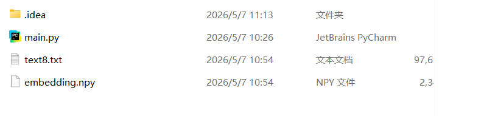

# 实验三：基于 Skip-gram 的词向量表示与相似度计算


实验地点:计算机大楼606




实验目的：    理解并掌握 Skip-gram 词向量模型的训练流程，以及词向量余弦相似度的计算方法。

实验环境（硬件和软件）  Windows 11，Python 3.12 虚拟环境，PaddlePaddle（CPU）

实验内容：

使用 PaddlePaddle 实现 Skip-gram 词向量模型的训练以及词的余弦相似度计算。

实验流程包括：读取英文语料并完成分词、词表构建和 Skip-gram 样本对生成；定义包含 embedding 层和输出层的神经网络；训练模型并输出 train_loss 与 val_loss；最后计算 king/queen、she/her、topic/theme 等词对的余弦相似度。

在理解算法原理和程序实现的基础上，需要对训练结果进行分析，并回答如下问题：

- **（1）谈谈你对程序的 SkipGram 类中 self.embedding 作用的理解。**

- **（2）build_data() 方法的作用是什么，输出数据的构成是怎样的？**

实验步骤：

### 1. 数据处理与样本构造：程序先读取默认语料，进行分词、词表构建，再用滑动窗口把语料转换为 (center_word_id, context_word_id) 形式的监督样本。

```python
def build_data(token_ids: Sequence[int], window_size: int) -> list[tuple[int, int]]:
    # build_data converts the full token-id stream into supervised Skip-gram
    # training pairs shaped as (center_word_id, context_word_id).
    training_pairs: list[tuple[int, int]] = []
    for center_index, center_word_id in enumerate(token_ids):
        left = max(0, center_index - window_size)
        right = min(len(token_ids), center_index + window_size + 1)
        for context_index in range(left, right):
            if context_index == center_index:
                continue
            training_pairs.append((center_word_id, token_ids[context_index]))
    if not training_pairs:
        raise ValueError("No Skip-gram pairs were created. Check the corpus length and window size.")
    return training_pairs
```

### 2. 网络定义：模型由词嵌入层和输出层组成，self.embedding 保存每个词 id 对应的稠密向量表示。

```python
class SkipGram(nn.Layer):
    def __init__(self, vocab_size: int, embedding_dim: int) -> None:
        super().__init__()
        # self.embedding stores the dense vector for each word id and is the core
        # representation that we later reuse for cosine-similarity queries.
        self.embedding = nn.Embedding(vocab_size, embedding_dim)
        self.output = nn.Linear(embedding_dim, vocab_size)

    def forward(self, center_words: paddle.Tensor) -> paddle.Tensor:
        hidden = self.embedding(center_words)
        return self.output(hidden)
```

### 3. 训练与评估：训练过程中按 epoch 记录 train_loss 和 val_loss，训练结束后再用 embedding 权重计算目标词对的余弦相似度。

```python
def train_model(
    model: SkipGram,
    train_pairs: Sequence[tuple[int, int]],
    validation_pairs: Sequence[tuple[int, int]],
    config: TrainConfig,
) -> list[dict[str, float | int | None]]:
    optimizer = paddle.optimizer.Adam(learning_rate=config.learning_rate, parameters=model.parameters())
    history: list[dict[str, float | int | None]] = []

    for epoch in range(1, config.epochs + 1):
        shuffled = list(train_pairs)
        random.shuffle(shuffled)
        batch_losses: list[float] = []

        for centers, contexts in iterate_batches(shuffled, config.batch_size):
            logits = model(centers)
            loss = F.cross_entropy(logits, contexts)
            loss.backward()
            optimizer.step()
            optimizer.clear_grad()
            batch_losses.append(float(loss.numpy().item()))

        train_loss = sum(batch_losses) / len(batch_losses)
        validation_loss = evaluate_loss(model, validation_pairs, config.batch_size)
        epoch_record = {
            "epoch": epoch,
            "train_loss": train_loss,
            "validation_loss": validation_loss,
        }
        history.append(epoch_record)

        if epoch == 1 or epoch % config.log_every == 0 or epoch == config.epochs:
            validation_text = f", val_loss={validation_loss:.4f}" if validation_loss is not None else ""
            print(f"Epoch {epoch:03d}: train_loss={train_loss:.4f}{validation_text}")

    return history
```

```python
def cosine_similarity(embedding_matrix: paddle.Tensor, word_to_id: dict[str, int], first: str, second: str) -> float:
    if first not in word_to_id or second not in word_to_id:
        raise KeyError(f"Cannot compute similarity because '{first}' or '{second}' is missing from the vocabulary.")
    first_vector = embedding_matrix[word_to_id[first]]
    second_vector = embedding_matrix[word_to_id[second]]
    numerator = float(paddle.dot(first_vector, second_vector).numpy().item())
    denominator = math.sqrt(float(paddle.dot(first_vector, first_vector).numpy().item())) * math.sqrt(
        float(paddle.dot(second_vector, second_vector).numpy().item())
    )
    return numerator / denominator if denominator else 0.0
```

- **（1）谈谈你对程序的 SkipGram 类中 self.embedding 作用的理解？**

在 SkipGram 类中，self.embedding 是一个可训练的词嵌入层，本质上保存了一张从词 id 到低维稠密向量的映射表。模型前向传播时会先根据中心词 id 取出对应向量，再交给输出层预测上下文词。

训练过程中，这个 embedding 矩阵会随着损失反向传播不断更新，使共享上下文较多的词在向量空间中逐渐靠近。训练结束后，self.embedding 的权重也会被直接复用为实验最终的词向量结果，用于计算 king/queen、topic/theme 等词对的余弦相似度。

- **（2）build_data() 方法的作用是什么，输出数据的构成是怎样的？**

build_data() 的作用是把顺序排列的 token id 序列转换成适合 Skip-gram 监督学习的训练样本。它会以每个位置的词作为中心词，再在给定窗口范围内遍历左右上下文词，把中心词与上下文词组织成训练对。

因此，输出数据由大量 (center_word_id, context_word_id) 二元组构成。一段原始文本会被扩展成许多监督样本，使模型能够学习“给定中心词，预测上下文词”的统计关系。

实验数据记录：

### 1. 默认语料为英文合成语料，共统计到 182 个 token，构建出的词表大小为 43。

### 2. 训练配置：embedding_dim=32，window_size=2，batch_size=16，epochs=160，learning_rate=0.03，validation_ratio=0.1，device=cpu。

### 3. 损失变化：第 1 个 epoch 的 train_loss=3.4667，val_loss=2.8939；第 160 个 epoch 的 train_loss=2.3819，val_loss=3.2127。

### 4. 余弦相似度结果：king/queen=0.179277，she/her=0.600865，topic/theme=0.461611，woman/game=-0.001227，one/name=0.310913。

### 5. 运行结束后在 lab03/outputs/ 目录下生成了 run_config.json、vocab.json、training_metrics.json 和 similarity_results.json，便于后续复现与核查。

问题讨论：

问题：在小规模教学语料上训练时，部分词对的相似度与题目示例存在明显差距，例如 king/queen 的相似度偏低。

现象描述：训练损失整体下降，但验证损失后期上升，说明模型已经学到一定规律，同时也暴露出语料规模偏小、上下文模式有限的问题。

原因分析：默认语料是为了课堂演示而构造的小型英文文本，训练样本量有限，皇室相关上下文不够丰富，因此 king 和 queen 虽然相关，但向量空间中的接近程度仍有限。

解决方法：后续可以扩大语料规模、增加更丰富的同类上下文、适当调节 embedding 维度和训练轮次，并结合更稳定的验证策略来提升词向量质量。
