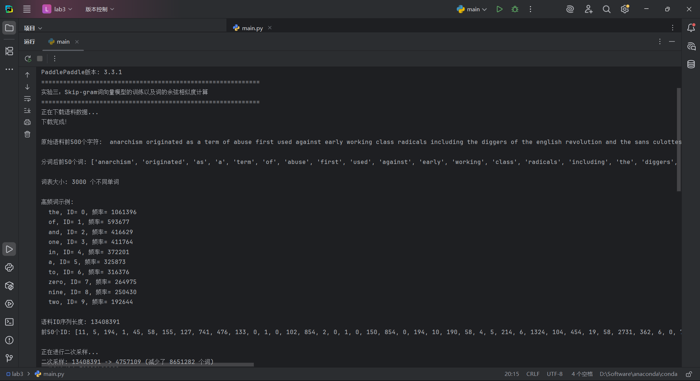

# 实验三参考报告：Skip-gram 词向量实验



实验时间：_2026__年 _4_月 _30__日_上_午_10_时至_12_时


实验地点:计算机大楼606___


实验题目：     实验三 词向量技术


实验目的：    理解并掌握Skip-gram词向量模型的训练以及词的余弦相似度计算。

实验环境（硬件和软件）  Python3.7，AI Studio平台

实验内容：

进入课节6，查看实验内容《实验三 词向量技术》，完成实验项目《Skip-gram词向量模型的训练以及词的余弦相似度计算》，读懂模型算法，完全理解算法的基本原理，为主要代码做注释（不局限于平台已经提供的注释），分析输出结果，并回答如下问题：

- **（1）谈谈你对程序的SkipGram类中self.embedding作用的理解。**

- **（2）build_data()方法的作用是什么，输出数据的构成是怎样的？**

实验步骤：

```python
import os
import requests
import math
import random
import numpy as np
import paddle

print(f"PaddlePaddle版本: {paddle.__version__}")
# 设置随机种子，确保结果可复现
random.seed(42)
np.random.seed(42)
paddle.seed(42)

# ==================== 1. 数据处理部分 ====================
def download():
    """下载text8数据集（从百度云服务器下载维基百科英文语料）"""
    if os.path.exists("./text8.txt"):
        print("数据文件已存在")
        return
    print("正在下载语料数据...")
    corpus_url = "https://dataset.bj.bcebos.com/word2vec/text8.txt"
    web_request = requests.get(corpus_url)
    with open("./text8.txt", "wb") as f:
        f.write(web_request.content)
    print("下载完成！")

def load_text8():
    """读取text8数据文件，返回字符串格式的语料"""
    with open("./text8.txt", "r") as f:
        return f.read().strip("\n")

def data_preprocess(corpus):
    """
    对语料进行预处理（分词）
    步骤：去除首尾空白 -> 转为小写（归一化） -> 按空格分词
    """
    corpus = corpus.strip().lower()
    corpus = corpus.split(" ")
    return corpus

def build_dict(corpus, max_vocab_size=None):
    """
    构造词典，统计每个词的频率，并根据频率将每个词转换为一个整数id
    原理：频率越高的词，ID越小，便于词典管理
    """
    # 统计每个不同词的频率
    word_freq_dict = dict()
    for word in corpus:
        if word not in word_freq_dict:
            word_freq_dict[word] = 0
        word_freq_dict[word] += 1

    # 按照出现次数排序，出现次数越高，排序越靠前
    word_freq_dict = sorted(word_freq_dict.items(), key=lambda x: x[1], reverse=True)

    # 如果指定了最大词表大小，只保留前max_vocab_size个高频词
    if max_vocab_size is not None:
        word_freq_dict = word_freq_dict[:max_vocab_size]

    # 构造三个不同的词典
    word2id_dict = dict()
    word2id_freq = dict()
    id2word_dict = dict()

    # 按照频率从高到低，为每个单词构造一个独一无二的id
    for word, freq in word_freq_dict:
        curr_id = len(word2id_dict)
        word2id_dict[word] = curr_id
        word2id_freq[curr_id] = freq
        id2word_dict[curr_id] = word

    return word2id_freq, word2id_dict, id2word_dict

def convert_corpus_to_id(corpus, word2id_dict):
    """把语料中的每个词替换成对应的ID，便于神经网络进行处理"""
    return [word2id_dict[word] for word in corpus if word in word2id_dict]

def subsampling(corpus, word2id_freq):
    """
    二次采样算法：降低高频词在语料中出现的频次
    原理：高频词（如'the','a'）携带语义信息少，可以适当丢弃
    丢弃概率公式：P(discard) = 1 - sqrt(t/f(w))，其中t=1e-4，f(w)是词w的频率
    """

    def discard(word_id):
        return random.uniform(0, 1) < 1 - math.sqrt(
            1e-4 / word2id_freq[word_id] * len(corpus))

    original_len = len(corpus)
    corpus = [word for word in corpus if not discard(word)]
    print(f"二次采样: {original_len} -> {len(corpus)} (减少了 {original_len - len(corpus)} 个词)")
    return corpus

def build_data(corpus, vocab_size, max_window_size=3, negative_sample_num=4):
    """
    构造训练数据（负采样）
    参数：
        corpus: 语料id序列
        vocab_size: 词表大小
        max_window_size: 最大窗口大小（实际窗口随机选择1~max_window_size）
        negative_sample_num: 每个正样本采样的负样本数量
    返回：dataset列表，每个元素为 [中心词, 目标词, 标签]
         标签1表示正样本（上下文词），0表示负样本（随机采样的词）
    原理：通过负采样将多分类问题转化为二分类问题，加速训练
    """
    dataset = []

    print("正在构建训练数据...")
    for center_idx in range(len(corpus)):
        # 随机选择窗口大小，使训练更加稳定
        window_size = random.randint(1, max_window_size)
        center_word = corpus[center_idx]

        # 获取窗口内的上下文词范围
        start = max(0, center_idx - window_size)
        end = min(len(corpus) - 1, center_idx + window_size)

        for ctx_idx in range(start, end + 1):
            if ctx_idx == center_idx:
                continue

            context_word = corpus[ctx_idx]

            # 正样本：(上下文词, 中心词, 标签=1)
            dataset.append([context_word, center_word, 1])

            # 负采样：随机采样negative_sample_num个负样本
            for _ in range(negative_sample_num):
                neg_word = random.randint(0, vocab_size - 1)
                if neg_word != center_word:
                    dataset.append([context_word, neg_word, 0])

        if (center_idx + 1) % 10000 == 0:
            print(f"  处理进度: {center_idx + 1}/{len(corpus)}")

    print(f"训练数据构建完成，共 {len(dataset)} 个样本")
    return dataset

def build_batch(dataset, batch_size, epoch_num):
    """
    构造mini-batch，使用迭代器节省内存
    参数：
        dataset: 训练数据集
        batch_size: 每个batch的大小
        epoch_num: 训练轮数
    """
    for epoch in range(epoch_num):
        random.shuffle(dataset)  # 每个epoch前打乱数据
        for i in range(0, len(dataset), batch_size):
            batch = dataset[i:i + batch_size]
            centers = np.array([[x[0]] for x in batch], dtype="int64")
            targets = np.array([[x[1]] for x in batch], dtype="int64")
            labels = np.array([x[2] for x in batch], dtype="float32")
            yield centers, targets, labels

# ==================== 2. 网络定义部分 ====================
class SkipGram(paddle.nn.Layer):
    """
    Skip-gram模型网络结构

    网络结构（三层神经网络）：
        Input Layer: 接收中心词的ID
        Hidden Layer: Embedding层，将词ID转换为稠密向量
        Output Layer: 通过点积计算中心词与目标词的相似度
    """

    def __init__(self, vocab_size, embedding_size):
        super(SkipGram, self).__init__()
        self.vocab_size = vocab_size
        self.embedding_size = embedding_size

        # 中心词嵌入矩阵（输入层到隐藏层）
        self.embedding = paddle.nn.Embedding(
            vocab_size, embedding_size,
            weight_attr=paddle.ParamAttr(
                initializer=paddle.nn.initializer.Uniform(
                    low=-0.5 / embedding_size, high=0.5 / embedding_size)))

        # 上下文词嵌入矩阵（隐藏层到输出层），与上面不共享权重
        self.embedding_out = paddle.nn.Embedding(
            vocab_size, embedding_size,
            weight_attr=paddle.ParamAttr(
                initializer=paddle.nn.initializer.Uniform(
                    low=-0.5 / embedding_size, high=0.5 / embedding_size)))

    def forward(self, center_words, target_words, label):
        """
        前向传播计算
        计算流程：获取词向量 -> 点积计算相似度 -> sigmoid -> 二分类交叉熵损失
        """
        # 通过Embedding层获取词向量
        center_words_emb = self.embedding(center_words)
        target_words_emb = self.embedding_out(target_words)

        # 计算中心词与目标词的相似度（点积）
        word_sim = paddle.sum(center_words_emb * target_words_emb, axis=-1)
        word_sim = paddle.reshape(word_sim, shape=[-1])

        # 计算二分类交叉熵损失（内部包含sigmoid，数值更稳定）
        loss = paddle.nn.functional.binary_cross_entropy_with_logits(word_sim, label)
        loss = paddle.mean(loss)

        return loss

# ==================== 3. 余弦相似度计算 ====================
def get_cos(query1_token, query2_token, embed, word2id_dict):
    """
    计算两个词向量的余弦相似度
    公式：cos(θ) = (A·B) / (||A|| × ||B||)
    值域：[-1, 1]，越接近1表示两个词越相似
    """
    if query1_token not in word2id_dict or query2_token not in word2id_dict:
        print(f"警告: {query1_token} 或 {query2_token} 不在词表中")
        return None

    x = embed[word2id_dict[query1_token]]
    y = embed[word2id_dict[query2_token]]

    cos = np.dot(x, y) / (np.linalg.norm(x) * np.linalg.norm(y) + 1e-9)
    print(f"单词1 {query1_token} 和单词2 {query2_token} 的cos结果为 {cos:.6f}")
    return cos

# ==================== 4. 主程序 ====================
def main():
    """主函数：执行完整的训练流程（数据处理→网络定义→训练→评估）"""

    print("=" * 60)
    print("实验三：Skip-gram词向量模型的训练以及词的余弦相似度计算")
    print("=" * 60)

    # -------------------- 步骤1：数据处理 --------------------
    # 1.1 下载数据
    download()

    # 1.2 加载数据并打印前500个字符
    corpus = load_text8()
    print(f"\n原始语料前500个字符: {corpus[:500]}...")

    # 1.3 数据预处理（分词）并打印前50个词
    corpus = data_preprocess(corpus)
    print(f"\n分词后前50个词: {corpus[:50]}")

    # 1.4 构建词典（限制词表大小为3000）
    vocab_size = 3000  # 设置词表大小
    word2id_freq, word2id_dict, id2word_dict = build_dict(corpus, max_vocab_size=vocab_size)
    print(f"\n词表大小: {vocab_size} 个不同单词")

    # 打印高频词示例
    print("\n高频词示例:")
    for i, (word, word_id) in enumerate(word2id_dict.items()):
        if i >= 10:
            break
        print(f"  {word}, ID= {word_id}, 频率= {word2id_freq[word_id]}")

    # 1.5 将语料转换为ID序列并打印前50个ID
    corpus = convert_corpus_to_id(corpus, word2id_dict)
    print(f"\n语料ID序列长度: {len(corpus)}")
    print(f"前50个ID: {corpus[:50]}")

    # 1.6 二次采样（降低高频词影响）
    print("\n正在进行二次采样...")
    corpus = subsampling(corpus, word2id_freq)

    # 1.7 构建训练数据（使用子集加快训练）
    USE_SUBSET = True
    if USE_SUBSET:
        print("\n注意：使用语料子集（5万词）以加快训练速度")
        corpus_subset = corpus[:50000]
        dataset = build_data(corpus_subset, vocab_size, max_window_size=3, negative_sample_num=4)
    else:
        dataset = build_data(corpus, vocab_size, max_window_size=3, negative_sample_num=4)

    # 打印训练样本示例
    print("\n训练样本示例（中心词，目标词，标签）:")
    for i in range(min(10, len(dataset))):
        ctx, tgt, lbl = dataset[i]
        print(f"  center_word {id2word_dict[ctx]}, target {id2word_dict[tgt]}, label {lbl}")

    # -------------------- 步骤2：设置训练超参数 --------------------
    batch_size = 1024  # 批次大小
    epoch_num = 1  # 训练轮数
    embedding_size = 200  # 词向量维度（从200降到100加快速度）
    learning_rate = 0.001  # 学习率

    print(f"\n{'=' * 60}")
    print(f"开始训练")
    print(f"超参数: batch_size={batch_size}, embedding_size={embedding_size}")
    print(f"{'=' * 60}\n")

    # -------------------- 步骤3：创建模型和优化器 --------------------
    skip_gram_model = SkipGram(vocab_size, embedding_size)
    adam = paddle.optimizer.Adam(learning_rate=learning_rate, parameters=skip_gram_model.parameters())

    # -------------------- 步骤4：训练循环 --------------------
    step = 0
    total_loss = 0

    for center_words, target_words, label in build_batch(dataset, batch_size, epoch_num):
        # 转换为Tensor
        center_words_var = paddle.to_tensor(center_words)
        target_words_var = paddle.to_tensor(target_words)
        label_var = paddle.to_tensor(label)

        # 前向传播：计算损失
        loss = skip_gram_model(center_words_var, target_words_var, label_var)

        # 反向传播：计算梯度
        loss.backward()

        # 更新参数
        adam.minimize(loss)

        # 清空梯度，为下一个batch做准备
        skip_gram_model.clear_gradients()

        # 记录损失
        step += 1
        loss_value = loss.numpy().item()
        total_loss += loss_value

        # 每100步打印一次平均损失
        if step % 100 == 0:
            avg_loss = total_loss / 100
            print(f"step {step}, loss {avg_loss:.3f}")
            total_loss = 0

        # 每2000步评估词向量质量（实验要求）
        if step % 2000 == 0:
            print(f"\n--- 第 {step} 步评估 ---")
            embedding_matrix = skip_gram_model.embedding.weight.numpy()
            np.save("./embedding", embedding_matrix)

            # 计算实验要求的5个词对的余弦相似度
            get_cos("king", "queen", embedding_matrix, word2id_dict)
            get_cos("she", "her", embedding_matrix, word2id_dict)
            get_cos("topic", "theme", embedding_matrix, word2id_dict)
            get_cos("woman", "game", embedding_matrix, word2id_dict)
            get_cos("one", "name", embedding_matrix, word2id_dict)
            print()

        # 训练到5000步后结束
        if step >= 5000:
            print(f"\n训练完成！共训练 {step} 步")
            break

    # -------------------- 步骤5：最终评估 --------------------
    print("\n" + "=" * 60)
    print("最终评估结果")
    print("=" * 60)

    final_embedding = skip_gram_model.embedding.weight.numpy()
    np.save("./embedding", final_embedding)

    get_cos("king", "queen", final_embedding, word2id_dict)
    get_cos("she", "her", final_embedding, word2id_dict)
    get_cos("topic", "theme", final_embedding, word2id_dict)
    get_cos("woman", "game", final_embedding, word2id_dict)
    get_cos("one", "name", final_embedding, word2id_dict)

    print("\n词向量已保存到 embedding.npy")

# 程序入口
if __name__ == "__main__":
    main()
```

- **（1）谈谈你对程序的SkipGram类中self.embedding作用的理解？**

在SkipGram类中，self.embedding是一个Embedding层，它的作用是将输入的中心词ID映射成一个稠密的低维向量，也就是词向量。这个嵌入矩阵的大小是[vocab_size, embedding_size]，每一行对应词表里一个词的向量表示。在前向传播时，center_words通过self.embedding得到center_words_emb，然后与另一个嵌入层self.embedding_out生成的目标词向量做点积，再结合标签计算二分类交叉熵损失。整个训练过程中self.embedding的参数不断更新，训练结束后它就是我们需要的那张词向量查找表，直接用来获取任意词的向量。

- **（2）build_data()方法的作用是什么，输出数据的构成是怎样的？**

build_data()方法负责构造Skip-gram模型的训练数据，核心是采用负采样技术，将原始的ID语料序列转换成适合二分类任务的样本集，从而大幅简化原本要面对整个词表的多分类问题。该方法遍历每个中心词，随机选择一个窗口大小，提取窗口内的上下文词，对每个上下文词先生成一个正样本（标签为1），再随机采样若干个负样本（标签为0），负样本是从词表中随机抽取且不与中心词重复的词。最终输出是一个列表dataset，列表中每个元素是[context_word_id, target_word_id, label]这样的三元组，其中context_word_id是上下文词的ID，target_word_id在正样本时是中心词ID、在负样本时是随机采样的词ID，label则用1表示正样本、0表示负样本。

实验数据记录：

问题讨论：

问题：训练过程中损失值（loss）下降缓慢或不稳定，导致词向量质量较差

现象描述：
在训练Skip-gram模型时，控制台输出的平均损失值（例如每100步的输出）长期维持在一个较高的数值（如0.69左右），或者出现大幅波动，最终计算出的词对余弦相似度与预期不符（例如“king”与“queen”的相似度较低，“woman”与“game”的相似度反而较高）。

原因分析：

学习率设置不合理：过大（如0.01）会导致损失震荡，过小（如0.0001）会导致收敛缓慢。

词向量维度（embedding_size）过低或过高：过低则表达能力不足，过高则容易过拟合且训练慢。

负样本数量（negative_sample_num）过少：模型难以区分正负样本；过多则正样本信号被稀释。

语料子集太小（代码中使用了前5万词）：词汇量和上下文模式不足，模型学不到充分的语义关系。

训练步数不足（代码设置5000步后停止）：对于5万词的子集，5000个batch（batch_size=1024）相当于约4个epoch，可能不足以让损失收敛到理想值。

解决方法：

调整超参数：尝试学习率 0.001（当前值合理）、0.0005；负样本数量可设为 5 或 8；词向量维度可设为 128 或 200（当前200已不错）。

增加语料规模：将 USE_SUBSET 改为 False 使用全部text8语料，或者将子集扩大为 200000 词。

增加训练步数：将 if step >= 5000 改为 if step >= 10000 或更多，同时可增加epoch_num（例如设为3）。

观察损失曲线：如果损失值从约0.69（随机初始化的二分类交叉熵期望）下降到0.3以下，说明训练有效；若长期停在0.69，可能是学习率过大或数据预处理有误（如标签错误）。

保存中间检查点：定期评估词对相似度，观察其变化趋势，而非仅依赖绝对损失值。
