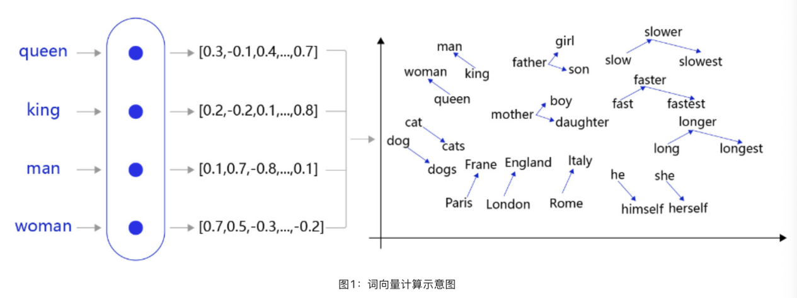
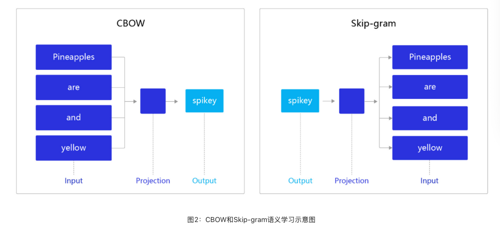
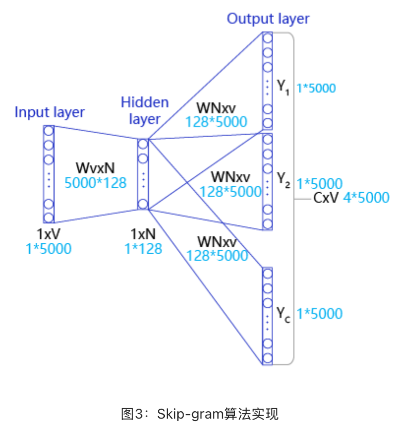

# 实验三补充教程：词向量训练原理与实战

词向量训练



在自然语言处理任务中，词向量是表示自然语言里单词的一种方法，即把每个词都表示为一个N维空间内的点，即一个高维空间内的向量。通过这种方法，实现把自然语言计算转换为向量计算。如 图1 所示的词向量计算任务中，先把每个词（如queen，king等）转换成一个高维空间的向量，这些向量在一定意义上可以代表这个词的语义信息。再通过计算这些向量之间的距离，就可以计算出词语之间的关联关系，从而达到让计算机像计算数值一样去计算自然语言的目的。





word2vec包含两个经典模型，CBOW（Continuous Bag-of-Words）和Skip-gram，如 图2 所示。

CBOW：通过上下文的词向量推理中心词。

Skip-gram：根据中心词推理上下文。

Skip-gram的算法实现

我们以这句话：“Pineapples are spiked and yellow”为例分别介绍Skip-gram的算法实现。如 图3 所示，Skip-gram是一个具有3层结构的神经网络，分别是：

Input Layer（输入层）：接收一个one-hot张量

V

∈

R

1

×

vocab_size

V∈R

1×vocab_size

作为网络的输入，里面存储着当前句子中心词的one-hot表示。

Hidden Layer（隐藏层）：将张量

V

V乘以一个word embedding张量

W

1

∈

R

vocab_size

×

embed_size

W

1

∈R

vocab_size×embed_size

，并把结果作为隐藏层的输出，得到一个形状为

R

1

×

embed_size

R

1×embed_size

的张量，里面存储着当前句子中心词的词向量。

Output Layer（输出层）：将隐藏层的结果乘以另一个word embedding张量

W

2

∈

R

embed_size

×

vocab_size

W

2

∈R

embed_size×vocab_size

，得到一个形状为

R

1

×

vocab_size

R

1×vocab_size

的张量。这个张量经过softmax变换后，就得到了使用当前中心词对上下文的预测结果。根据这个softmax的结果，我们就可以去训练词向量模型。

在实际操作中，使用一个滑动窗口（一般情况下，长度是奇数），从左到右开始扫描当前句子。每个扫描出来的片段被当成一个小句子，每个小句子中间的词被认为是中心词，其余的词被认为是这个中心词的上下文。

Skip-gram的实际实现

在实际情况中，vocab_size通常很大（几十万甚至几百万），导致

W

W非常大。为了缓解这个问题，通常采取负采样（negative_sampling）的方式来近似模拟多分类任务。

假设有一个中心词

c

c和一个上下文词正样本

t

p

t

p

​

。在Skip-gram的理想实现里，需要最大化使用

c

c推理

t

p

t

p

​

的概率。在使用softmax学习时，需要最大化

t

p

t

p

​

的推理概率，同时最小化其他词表中词的推理概率。之所以计算缓慢，是因为需要对词表中的所有词都计算一遍。然而我们还可以使用另一种方法，就是随机从词表中选择几个代表词，通过最小化这几个代表词的概率，去近似最小化整体的预测概率。比如，先指定一个中心词（如“人工”）和一个目标词正样本（如“智能”），再随机在词表中采样几个目标词负样本（如“日本”，“喝茶”等）。有了这些内容，我们的skip-gram模型就变成了一个二分类任务。对于目标词正样本，我们需要最大化它的预测概率；对于目标词负样本，我们需要最小化它的预测概率。通过这种方式，我们就可以完成计算加速。上述做法，我们称之为负采样。

在实现的过程中，通常会让模型接收3个tensor输入：

代表中心词的tensor：假设我们称之为center_words

V

V，一般来说，这个tensor是一个形状为[batch_size, vocab_size]的one-hot tensor，表示在一个mini-batch中每个中心词具体的ID。

代表目标词的tensor：假设我们称之为target_words

T

T，一般来说，这个tensor同样是一个形状为[batch_size, vocab_size]的one-hot tensor，表示在一个mini-batch中每个目标词具体的ID。

代表目标词标签的tensor：假设我们称之为labels

L

一般来说，这个tensor是一个形状为[batch_size, 1]的tensor，每个元素不是0就是1（0：负样本，1：正样本）。

使用飞桨实现Skip-gram

接下来我们将学习使用飞桨实现Skio-gram模型的方法。在飞桨中，不同深度学习模型的训练过程基本一致，流程如下：

数据处理：选择需要使用的数据，并做好必要的预处理工作。

网络定义：使用飞桨定义好网络结构，包括输入层，中间层，输出层，损失函数和优化算法。

网络训练：将准备好的数据送入神经网络进行学习，并观察学习的过程是否正常，如损失函数值是否在降低，也可以打印一些中间步骤的结果出来等。

网络评估：使用测试集合测试训练好的神经网络，看看训练效果如何。

在数据处理前，需要先加载飞桨平台（如果用户在本地使用，请确保已经安装飞桨）。

```python
import io
```

```python
import os
```

```python
import sys
```

```python
import requests
```

```python
import math
```

```python
import random
```

```python
import numpy as np
```

```python
import paddle
```

数据处理

首先，找到一个合适的语料用于训练word2vec模型。我们选择text8数据集，这个数据集里包含了大量从维基百科收集到的英文语料，我们可以通过如下代码下载数据集，下载后的文件被保存在当前目录的text8.txt文件内。

# 下载语料用来训练word2vec

```python
def download():
```

# 可以从百度云服务器下载一些开源数据集（dataset.bj.bcebos.com）

corpus_url = "https://dataset.bj.bcebos.com/word2vec/text8.txt"

# 使用python的requests包下载数据集到本地

web_request = requests.get(corpus_url)

corpus = web_request.content

# 把下载后的文件存储在当前目录的text8.txt文件内

with open("./text8.txt", "wb") as f:

f.write(corpus)

f.close()

download()

接下来，把下载的语料读取到程序里，并打印前500个字符看看语料的样子，代码如下：

# 读取text8数据

```python
def load_text8():
```

with open("./text8.txt", "r") as f:

corpus = f.read().strip("\n")

f.close()

```python
return corpus
```

corpus = load_text8()

# 打印前500个字符，简要看一下这个语料的样子

print(corpus[:500])

一般来说，在自然语言处理中，需要先对语料进行切词。对于英文来说，可以比较简单地直接使用空格进行切词，代码如下：

# 对语料进行预处理（分词）

```python
def data_preprocess(corpus):
```

# 由于英文单词出现在句首的时候经常要大写，所以我们把所有英文字符都转换为小写，

# 以便对语料进行归一化处理（Apple vs apple等）

corpus = corpus.strip().lower()

corpus = corpus.split(" ")

```python
return corpus
```

corpus = data_preprocess(corpus)

print(corpus[:50])

在经过切词后，需要对语料进行统计，为每个词构造ID。一般来说，可以根据每个词在语料中出现的频次构造ID，频次越高，ID越小，便于对词典进行管理。代码如下：

# 构造词典，统计每个词的频率，并根据频率将每个词转换为一个整数id

```python
def build_dict(corpus):
```

# 首先统计每个不同词的频率（出现的次数），使用一个词典记录

word_freq_dict = dict()

for word in corpus:

if word not in word_freq_dict:

word_freq_dict[word] = 0

word_freq_dict[word] += 1

# 将这个词典中的词，按照出现次数排序，出现次数越高，排序越靠前

# 一般来说，出现频率高的高频词往往是：I，the，you这种代词，而出现频率低的词，往往是一些名词，如：nlp

word_freq_dict = sorted(word_freq_dict.items(), key = lambda x:x[1], reverse = True)

# 构造3个不同的词典，分别存储，

# 每个词到id的映射关系：word2id_dict

# 每个id出现的频率：word2id_freq

# 每个id到词典映射关系：id2word_dict

word2id_dict = dict()

word2id_freq = dict()

id2word_dict = dict()

# 按照频率，从高到低，开始遍历每个单词，并为这个单词构造一个独一无二的id

for word, freq in word_freq_dict:

curr_id = len(word2id_dict)

word2id_dict[word] = curr_id

word2id_freq[word2id_dict[word]] = freq

id2word_dict[curr_id] = word

```python
return word2id_freq, word2id_dict, id2word_dict
```

word2id_freq, word2id_dict, id2word_dict = build_dict(corpus)

vocab_size = len(word2id_freq)

print("there are totoally %d different words in the corpus" % vocab_size)

for _, (word, word_id) in zip(range(50), word2id_dict.items()):

print("word %s, its id %d, its word freq %d" % (word, word_id, word2id_freq[word_id]))

得到word2id词典后，我们还需要进一步处理原始语料，把每个词替换成对应的ID，便于神经网络进行处理，代码如下：

# 把语料转换为id序列

```python
def convert_corpus_to_id(corpus, word2id_dict):
```

# 使用一个循环，将语料中的每个词替换成对应的id，以便于神经网络进行处理

corpus = [word2id_dict[word] for word in corpus]

```python
return corpus
```

corpus = convert_corpus_to_id(corpus, word2id_dict)

print("%d tokens in the corpus" % len(corpus))

print(corpus[:50])

接下来，需要使用二次采样法处理原始文本。二次采样法的主要思想是降低高频词在语料中出现的频次，降低的方法是随机将高频的词抛弃，频率越高，被抛弃的概率就越高，频率越低，被抛弃的概率就越低，这样像标点符号或冠词这样的高频词就会被抛弃，从而优化整个词表的词向量训练效果，代码如下：

# 使用二次采样算法（subsampling）处理语料，强化训练效果

```python
def subsampling(corpus, word2id_freq):
```

# 这个discard函数决定了一个词会不会被替换，这个函数是具有随机性的，每次调用结果不同

# 如果一个词的频率很大，那么它被遗弃的概率就很大

```python
def discard(word_id):
```

```python
return random.uniform(0, 1) < 1 - math.sqrt(
```

1e-4 / word2id_freq[word_id] * len(corpus))

corpus = [word for word in corpus if not discard(word)]

```python
return corpus
```

corpus = subsampling(corpus, word2id_freq)

print("%d tokens in the corpus" % len(corpus))

print(corpus[:50])

在完成语料数据预处理之后，需要构造训练数据。根据上面的描述，我们需要使用一个滑动窗口对语料从左到右扫描，在每个窗口内，中心词需要预测它的上下文，并形成训练数据。

在实际操作中，由于词表往往很大（50000，100000等），对大词表的一些矩阵运算（如softmax）需要消耗巨大的资源，因此可以通过负采样的方式模拟softmax的结果，代码实现如下。

给定一个中心词和一个需要预测的上下文词，把这个上下文词作为正样本。

通过词表随机采样的方式，选择若干个负样本。

把一个大规模分类问题转化为一个2分类问题，通过这种方式优化计算速度。

# 构造数据，准备模型训练

# max_window_size代表了最大的window_size的大小，程序会根据max_window_size从左到右扫描整个语料

# negative_sample_num代表了对于每个正样本，我们需要随机采样多少负样本用于训练，

# 一般来说，negative_sample_num的值越大，训练效果越稳定，但是训练速度越慢。

```python
def build_data(corpus, word2id_dict, word2id_freq, max_window_size = 3,
```

negative_sample_num = 4):

# 使用一个list存储处理好的数据

dataset = []

center_word_idx=0

# 从左到右，开始枚举每个中心点的位置

while center_word_idx < len(corpus):

# 以max_window_size为上限，随机采样一个window_size，这样会使得训练更加稳定

window_size = random.randint(1, max_window_size)

# 当前的中心词就是center_word_idx所指向的词，可以当作正样本

positive_word = corpus[center_word_idx]

# 以当前中心词为中心，左右两侧在window_size内的词就是上下文

context_word_range = (max(0, center_word_idx - window_size), min(len(corpus) - 1, center_word_idx + window_size))

context_word_candidates = [corpus[idx] for idx in range(context_word_range[0], context_word_range[1]+1) if idx != center_word_idx]

# 对于每个正样本来说，随机采样negative_sample_num个负样本，用于训练

for context_word in context_word_candidates:

# 首先把（上下文，正样本，label=1）的三元组数据放入dataset中，

# 这里label=1表示这个样本是个正样本

dataset.append((context_word, positive_word, 1))

# 开始负采样

i = 0

while i < negative_sample_num:

negative_word_candidate = random.randint(0, vocab_size-1)

if negative_word_candidate is not positive_word:

# 把（上下文，负样本，label=0）的三元组数据放入dataset中，

# 这里label=0表示这个样本是个负样本

dataset.append((context_word, negative_word_candidate, 0))

i += 1

center_word_idx = min(len(corpus) - 1, center_word_idx + window_size)

if center_word_idx == (len(corpus) - 1):

center_word_idx += 1

if center_word_idx % 100000 == 0:

print(center_word_idx)

```python
return dataset
```

dataset = build_data(corpus, word2id_dict, word2id_freq)

for _, (context_word, target_word, label) in zip(range(50), dataset):

print("center_word %s, target %s, label %d" % (id2word_dict[context_word],

id2word_dict[target_word], label))

训练数据准备好后，把训练数据都组装成mini-batch，并准备输入到网络中进行训练，代码如下：

# 构造mini-batch，准备对模型进行训练

# 我们将不同类型的数据放到不同的tensor里，便于神经网络进行处理

# 并通过numpy的array函数，构造出不同的tensor来，并把这些tensor送入神经网络中进行训练

```python
def build_batch(dataset, batch_size, epoch_num):
```

# center_word_batch缓存batch_size个中心词

center_word_batch = []

# target_word_batch缓存batch_size个目标词（可以是正样本或者负样本）

target_word_batch = []

# label_batch缓存了batch_size个0或1的标签，用于模型训练

label_batch = []

for epoch in range(epoch_num):

# 每次开启一个新epoch之前，都对数据进行一次随机打乱，提高训练效果

random.shuffle(dataset)

for center_word, target_word, label in dataset:

# 遍历dataset中的每个样本，并将这些数据送到不同的tensor里

center_word_batch.append([center_word])

target_word_batch.append([target_word])

label_batch.append(label)

# 当样本积攒到一个batch_size后，我们把数据都返回回来

# 在这里我们使用numpy的array函数把list封装成tensor

# 并使用python的迭代器机制，将数据yield出来

# 使用迭代器的好处是可以节省内存

if len(center_word_batch) == batch_size:

yield np.array(center_word_batch).astype("int64"), \

np.array(target_word_batch).astype("int64"), \

np.array(label_batch).astype("float32")

center_word_batch = []

target_word_batch = []

label_batch = []

if len(center_word_batch) > 0:

yield np.array(center_word_batch).astype("int64"), \

np.array(target_word_batch).astype("int64"), \

np.array(label_batch).astype("float32")

# for _, batch in zip(range(10), build_batch(dataset, 128, 3)):

#     print(batch)

网络定义

定义skip-gram的网络结构，用于模型训练。在飞桨动态图中，对于任意网络，都需要定义一个继承自paddle.nn.Layer的类来搭建网络结构、参数等数据的声明。同时需要在forward函数中定义网络的计算逻辑。值得注意的是，我们仅需要定义网络的前向计算逻辑，飞桨会自动完成神经网络的反向计算，代码如下：

# 定义skip-gram训练网络结构

# 这里我们使用的是paddlepaddle的2.0.0版本

# 一般来说，在使用nn训练的时候，我们需要通过一个类来定义网络结构，这个类继承了paddle.nn.Layer

```python
class SkipGram(paddle.nn.Layer):
```

```python
def __init__(self, vocab_size, embedding_size, init_scale=0.1):
```

# vocab_size定义了这个skipgram这个模型的词表大小

# embedding_size定义了词向量的维度是多少

# init_scale定义了词向量初始化的范围，一般来说，比较小的初始化范围有助于模型训练

super(SkipGram, self).__init__()

self.vocab_size = vocab_size

self.embedding_size = embedding_size

# 使用paddle.nn提供的Embedding函数，构造一个词向量参数

# 这个参数的大小为：self.vocab_size, self.embedding_size

# 这个参数的名称为：embedding_para

# 这个参数的初始化方式为在[-init_scale, init_scale]区间进行均匀采样

self.embedding = paddle.nn.Embedding(

self.vocab_size,

self.embedding_size,

weight_attr=paddle.ParamAttr(

name='embedding_para',

initializer=paddle.nn.initializer.Uniform(

low=-0.5/embedding_size, high=0.5/embedding_size)))

# 使用paddle.nn提供的Embedding函数，构造另外一个词向量参数

# 这个参数的大小为：self.vocab_size, self.embedding_size

# 这个参数的名称为：embedding_para_out

# 这个参数的初始化方式为在[-init_scale, init_scale]区间进行均匀采样

# 跟上面不同的是，这个参数的名称跟上面不同，因此，

# embedding_para_out和embedding_para虽然有相同的shape，但是权重不共享

self.embedding_out = paddle.nn.Embedding(

self.vocab_size,

self.embedding_size,

weight_attr=paddle.ParamAttr(

name='embedding_out_para',

initializer=paddle.nn.initializer.Uniform(

low=-0.5/embedding_size, high=0.5/embedding_size)))

# 定义网络的前向计算逻辑

# center_words是一个tensor（mini-batch），表示中心词

# target_words是一个tensor（mini-batch），表示目标词

# label是一个tensor（mini-batch），表示这个词是正样本还是负样本（用0或1表示）

# 用于在训练中计算这个tensor中对应词的同义词，用于观察模型的训练效果

```python
def forward(self, center_words, target_words, label):
```

# 首先，通过embedding_para（self.embedding）参数，将mini-batch中的词转换为词向量

# 这里center_words和eval_words_emb查询的是一个相同的参数

# 而target_words_emb查询的是另一个参数

center_words_emb = self.embedding(center_words)

target_words_emb = self.embedding_out(target_words)

# center_words_emb = [batch_size, embedding_size]

# target_words_emb = [batch_size, embedding_size]

# 我们通过点乘的方式计算中心词到目标词的输出概率，并通过sigmoid函数估计这个词是正样本还是负样本的概率。

word_sim = paddle.multiply(center_words_emb, target_words_emb)

word_sim = paddle.sum(word_sim, axis = -1)

word_sim = paddle.reshape(word_sim, shape=[-1])

pred = paddle.nn.functional.sigmoid(word_sim)

# 通过估计的输出概率定义损失函数，注意我们使用的是binary_cross_entropy函数

# 将sigmoid计算和cross entropy合并成一步计算可以更好的优化，所以输入的是word_sim，而不是pred

loss=paddle.nn.functional.binary_cross_entropy(paddle.nn.functional.sigmoid(word_sim), label)

loss = paddle.mean(loss)

# 返回前向计算的结果，飞桨会通过backward函数自动计算出反向结果。

```python
return pred, loss
```

网络训练

完成网络定义后，就可以启动模型训练。我们定义每隔100步打印一次Loss，以确保当前的网络是正常收敛的。同时，我们每隔1000步观察一下skip-gram计算出来的同义词（使用 embedding的乘积），可视化网络训练效果，代码如下：

# 开始训练，定义一些训练过程中需要使用的超参数

batch_size = 512

epoch_num = 1

embedding_size = 200

step = 0

learning_rate = 0.001

# 定义一个使用word-embedding计算cos的函数

```python
def get_cos(query1_token, query2_token, embed):
```

W = embed

x = W[word2id_dict[query1_token]]

y = W[word2id_dict[query2_token]]

cos = np.dot(x, y) / np.sqrt(np.sum(y * y) * np.sum(x * x) + 1e-9)

flat = cos.flatten()

print("单词1 %s 和单词2 %s 的cos结果为 %f" %(query1_token, query2_token, cos))

# 通过我们定义的SkipGram类，来构造一个Skip-gram模型网络

skip_gram_model = SkipGram(vocab_size, embedding_size)

# 构造训练这个网络的优化器

adam = paddle.optimizer.Adam(learning_rate=learning_rate, parameters = skip_gram_model.parameters())

# 使用build_batch函数，以mini-batch为单位，遍历训练数据，并训练网络

for center_words, target_words, label in build_batch(

dataset, batch_size, epoch_num):

# 使用paddle.to_tensor函数，将一个numpy的tensor，转换为飞桨可计算的tensor

center_words_var = paddle.to_tensor(center_words)

target_words_var = paddle.to_tensor(target_words)

label_var = paddle.to_tensor(label)

# 将转换后的tensor送入飞桨中，进行一次前向计算，并得到计算结果

pred, loss = skip_gram_model(

center_words_var, target_words_var, label_var)

# 通过backward函数，让程序自动完成反向计算

loss.backward()

# 通过minimize函数，让程序根据loss，完成一步对参数的优化更新

adam.minimize(loss)

# 使用clear_gradients函数清空模型中的梯度，以便于下一个mini-batch进行更新

skip_gram_model.clear_gradients()

# 每经过100个mini-batch，打印一次当前的loss，看看loss是否在稳定下降

step += 1

if step % 100 == 0:

print("step %d, loss %.3f" % (step, loss.numpy()[0]))

# 经过10000个mini-batch，打印一次模型对eval_words中的10个词计算的同义词

# 这里我们使用词和词之间的向量点积作为衡量相似度的方法

# 我们只打印了5个最相似的词

if step % 2000 == 0:

embedding_matrix = skip_gram_model.embedding.weight.numpy()

np.save("./embedding", embedding_matrix)

get_cos("king","queen",embedding_matrix)

get_cos("she","her",embedding_matrix)

get_cos("topic","theme",embedding_matrix)

get_cos("woman","game",embedding_matrix)

get_cos("one","name",embedding_matrix)

从打印结果可以看到，经过一定步骤的训练，Loss逐渐下降并趋于稳定。

余弦相似度计算评价词向量结果

# 定义一个使用word-embedding计算cos的函数

```python
def get_cos(query1_token, query2_token, embed):
```

W = embed

x = W[word2id_dict[query1_token]]

y = W[word2id_dict[query2_token]]

cos = np.dot(x, y) / np.sqrt(np.sum(y * y) * np.sum(x * x) + 1e-9)

flat = cos.flatten()

print("单词1 %s 和单词2 %s 的cos结果为 %f" %(query1_token, query2_token, cos) )

embedding_matrix = np.load('embedding.npy')

get_cos("king","queen",embedding_matrix)

get_cos("she","her",embedding_matrix)

get_cos("topic","theme",embedding_matrix)

get_cos("woman","game",embedding_matrix)

get_cos("one","name",embedding_matrix)
