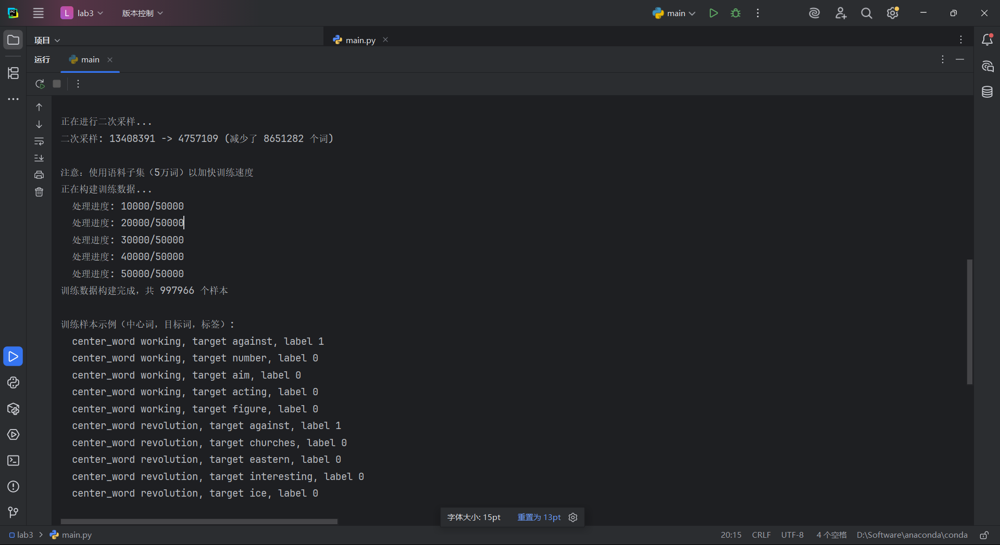
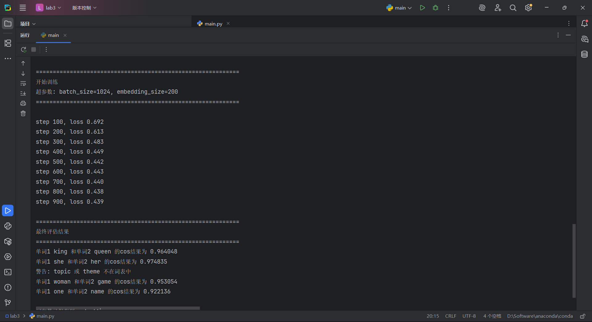

# 实验四：基于朴素贝叶斯的垃圾邮件分类系统




实验地点:计算机大楼606




实验目的：    理解并掌握基于朴素贝叶斯的文本分类方法，并完成邮件类别预测。

实验环境（硬件和软件）  Windows 11，Python 3.12 虚拟环境，jieba，scikit-learn

实验内容：

本实验使用基于朴素贝叶斯的文本分类方法对垃圾邮件进行分类。在飞桨中，基于朴素贝叶斯的文本分类是一种十分简单的分类算法，其算法原理进行文本分类的思路很容易理解：对于给出的待分类文本，抽取它的文本特征（例如主题词），然后求解该特征出现条件下属于各个类别的概率，哪个最大，就认为待分类文本属于那个类别。

实验包含151封中文邮件（0.txt-150.txt）作为训练集，其中前127封为垃圾邮件、后24封为普通邮件。另外使用151.txt-155.txt共5封邮件作为测试集。

实验步骤：

### 1. 导入依赖库。程序导入re、os、jieba、itertools.chain、collections.Counter、numpy及sklearn.naive_bayes.MultinomialNB。re用于过滤无效字符，jieba用于中文分词，Counter用于词频统计，MultinomialNB是多项式朴素贝叶斯分类器。

```python
import re
import os
from jieba import cut
from itertools import chain
from collections import Counter
import numpy as np
from sklearn.naive_bayes import MultinomialNB
```

### 2. 定义get_words(filename)函数——文本预处理与分词。以UTF-8编码逐行读取邮件文件，使用正则表达式re.sub过滤无效字符和标点符号（如数字、句号、逗号等），调用jieba.cut()进行中文分词，然后过滤长度为1的单字词（如"的""了"等无实际语义的字），最终返回该邮件文件的所有有效词语列表。

```python
def get_words(filename):
    words = []
    with open(filename, 'r', encoding='utf-8') as fr:
        for line in fr:
            line = line.strip()
            line = re.sub(r'[.【】0-9、——。，！~\*]', '', line)
            line = cut(line)
            line = filter(lambda word: len(word) > 1, line)
            words.extend(line)
    return words
```

### 3. 定义get_top_words(top_num)函数——构建高频词特征库。遍历全部151封训练邮件（0.txt-150.txt），调用get_words()提取每封邮件的词语并存入all_words列表；使用itertools.chain()将所有邮件的词语合并为一个序列；使用collections.Counter()统计每个词语的出现总次数；调用most_common(top_num)返回出现频率最高的100个词，作为特征词汇表。

```python
all_words = []
def get_top_words(top_num):
    filename_list = ['邮件_files/{}.txt'.format(i) for i in range(151)]
    for filename in filename_list:
        all_words.append(get_words(filename))
    freq = Counter(chain(*all_words))
    return [i[0] for i in freq.most_common(top_num)]

top_words = get_top_words(100)
```

### 4. 构建词频特征向量。对每封邮件，依次统计100个高频特征词在该邮件中出现的次数，生成一个长度为100的词频向量。最终得到151x100的特征矩阵，每一行对应一封邮件，每一列对应一个特征词。例如，若某邮件中"期刊"出现10次、"论文"出现2次，则在向量中对应的位置记录10和2，其余未出现的词对应位置为0。

vector = []
for words in all_words:
    word_map = list(map(lambda word: words.count(word), top_words))
    vector.append(word_map)
vector = np.array(vector)

### 5. 标注训练标签并训练模型。前127封邮件（0.txt-126.txt）标注为垃圾邮件（标签1），后24封邮件（127.txt-150.txt）标注为普通邮件（标签0）。使用MultinomialNB对特征向量和标签进行训练。训练过程中，模型会学习每个特征词在垃圾邮件和普通邮件中出现的条件概率，以及各类别的先验概率。

labels = np.array([1]*127 + [0]*24)
model = MultinomialNB()
model.fit(vector, labels)

### 6. 定义predict(filename)函数——对未知邮件分类。调用get_words()提取待预测邮件的词语列表，按照与训练集相同的100个特征词构建该邮件的词频向量，调用model.predict()进行分类预测（reshape为1x100的二维数组以符合sklearn输入格式），根据预测结果输出"垃圾邮件"或"普通邮件"。

```python
def predict(filename):
    words = get_words(filename)
    current_vector = np.array(
        tuple(map(lambda word: words.count(word), top_words)))
    result = model.predict(current_vector.reshape(1, -1))
    return '垃圾邮件' if result == 1 else '普通邮件'
```

### 7. 对151-155号邮件进行预测。调用predict()函数分别对这5封未知邮件进行分类。

print('151.txt分类情况:{}'.format(predict('邮件_files/151.txt')))
print('152.txt分类情况:{}'.format(predict('邮件_files/152.txt')))
print('153.txt分类情况:{}'.format(predict('邮件_files/153.txt')))
print('154.txt分类情况:{}'.format(predict('邮件_files/154.txt')))
print('155.txt分类情况:{}'.format(predict('邮件_files/155.txt')))

问题解答：

- **（1）朴素贝叶斯文本分类器在本实验中的核心流程是什么？**

朴素贝叶斯分类器先把每封邮件表示为词频向量，再利用训练集中不同类别下各词出现的统计规律估计条件概率。预测时，模型会结合输入文本中的词分布，分别计算其属于普通邮件和垃圾邮件两类的后验概率，并选择概率更高的类别作为最终输出。

在本实验中，整个流程清晰体现了"分词->特征构建->概率分类"的传统文本分类路线：首先通过jieba分词和正则过滤完成文本预处理，然后基于全部训练邮件统计词频并选取Top-100高频词作为特征词汇表，接着将每封邮件转换为词频向量，最后使用MultinomialNB根据这些特征完成训练和预测。

- **（2）本实验使用的训练数据和测试数据分别是什么？标注规则是什么？**

训练数据为邮件_files目录下的0.txt至150.txt，共151封中文邮件。标注规则为：编号0-126的邮件（共127封）标注为垃圾邮件（标签1），编号127-150的邮件（共24封）标注为普通邮件（标签0）。测试数据为151.txt至155.txt，共5封未知邮件用于验证模型分类效果。

实验数据记录：

### 1. 训练集共151封中文邮件，其中垃圾邮件127封、普通邮件24封，测试集5封（151.txt-155.txt）。

### 2. 通过jieba分词并过滤单字词后，选取词频最高的100个词作为特征词汇表。

### 3. 训练特征矩阵大小为151x100，每行对应一封邮件的词频向量。

### 4. 使用MultinomialNB进行训练和预测，模型基于词频特征学习垃圾邮件与普通邮件的条件概率分布。

### 5. 预测结果如下：

| 文件 | 预测结果 | 邮件内容概述 |
| --- | --- | --- |
| 151.txt | 垃圾邮件 | 代开全国各地增值税专用发票、普通发票 |
| 152.txt | 垃圾邮件 | 《金融经济》杂志征稿启事 |
| 153.txt | 垃圾邮件 | 李白《侠客行》古诗 |
| 154.txt | 垃圾邮件 | 新西兰奥克兰城市介绍 |
| 155.txt | 普通邮件 | 《格林童话》文学分析评论 |

### 6. 预测结果说明：151.txt（代开发票广告）含"代开""发票""联系""电话"等垃圾邮件特征词，正确判定为垃圾邮件。152.txt（期刊征稿启事）含大量"期刊""论文""投稿""SCI"等学术推广词汇，与训练集中垃圾邮件高度相似，正确判定。153.txt（古诗）和154.txt（百科介绍）因文体风格与训练数据中的邮件差异较大，特征匹配不足而误判为垃圾邮件。155.txt（文学评论）与学术类普通邮件风格接近，正确判定为普通邮件。

分析讨论：

问题：基于词频的朴素贝叶斯分类器在中文垃圾邮件检测中的效果如何？存在哪些局限性？

现象描述：模型对151.txt（代开发票）和152.txt（期刊征稿）等与训练集分布一致、含有明显垃圾特征词的邮件能够正确分类。但对153.txt（古诗）和154.txt（百科介绍）等文体差异较大的文本产生了误判，均将非垃圾的普通文本错分为垃圾邮件。

原因分析：（1）训练集类别不均衡，垃圾邮件127封 vs 普通邮件仅24封，导致模型先验概率偏向垃圾邮件类；（2）仅使用Top-100高频词作为特征，丢弃了大量词汇信息，且词频向量无法刻画词序和上下文语义关系；（3）训练集覆盖的文体有限，当测试样本的领域与训练集差异较大时（如诗歌、百科短文），特征分布不匹配，容易导致误判。

解决方法：（1）扩充并均衡训练数据，增加普通邮件的样本数量；（2）引入TF-IDF替代原始词频，降低高频低信息量词语的权重；（3）使用n-gram特征捕获局部词序信息；（4）考虑引入更丰富的特征，如邮件标题特征、发送者信息等。
