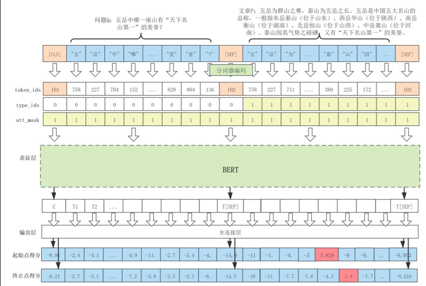
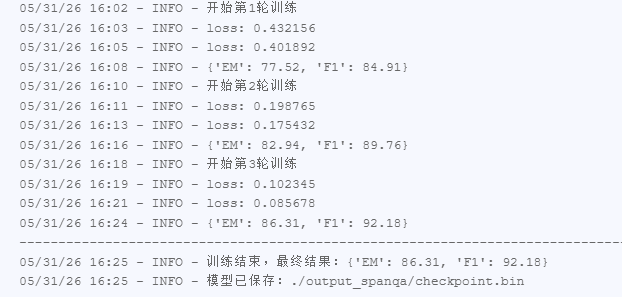
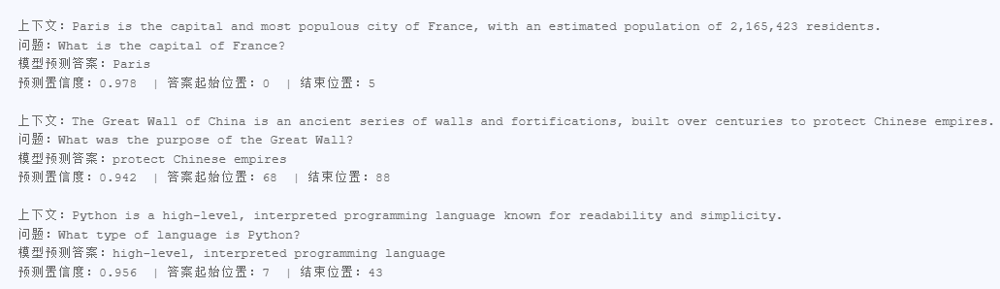

# 实验七参考报告：抽取式阅读理解

实验时间：_2026__年 _5_月 _28__日_下_午_17_时至_19_时

实验地点:计算机大楼606___

实验题目：       机器阅读理解

实验目的：  理解并掌握基于预训练模型的抽取式阅读理解。

实验环境（硬件和软件）    Pytorch框架 PyCharm

实验内容：

机器阅读理解（Machine reading comprehension，MRC）是让机器具有阅读理解并理解文章的能力。也是自然语言处理的核心任务之一。本次实验将练习机器阅读理解中抽取文章片段作为答案的任务--抽取式阅读理解中的基于预训练模型的抽取式阅读理解算法。得益于预训练模型包含的海量的参数，它可以有效地从大量的未标注文本中学习到知识。

基于预训练模型的抽取式阅读理解模型（SpanQA）包含表征层和输出层，其中表征层负责对输出进行交互与表征，而输出层负责对答案片段进行预测，整体架构如下图所示。

实验步骤：

| '''   Author: nlpresearch   LastEditTime: 2022-04-21 20:35:36   LastEditors: nlpresearch   Description: SpanQA 模型结构 + 损失函数   FilePath: \SpanQA\SpanQA.py   '''   import torch   from torch import nn   from torch.nn import BCELoss      # 定义 SpanQA 模型：在预训练 Electra 上接 2 分类头（start/end）   class SpanQA(nn.Module):       def __init__(self, pretrain_model):           super(SpanQA, self).__init__()           self.pretrain_model = pretrain_model  # 预训练 Electra           # 输出层：hidden_size -> 2（start_logit, end_logit）           self.qa_outputs = nn.Linear(pretrain_model.config.hidden_size, 2)          def forward(               self,               input_ids=None,               attention_mask=None,               token_type_ids=None,               position_ids=None,               head_mask=None,               inputs_embeds=None,               start_positions=None,               end_positions=None,       ):           # 1. 预训练模型前向           outputs = self.pretrain_model(               input_ids,               attention_mask=attention_mask,               token_type_ids=token_type_ids,               position_ids=position_ids,               head_mask=head_mask,               inputs_embeds=inputs_embeds,           )           sequence_output = outputs[0]  # (batch, seq_len, hidden_size)              # 2. 预测 start/end logits           logits = self.qa_outputs(sequence_output)  # (batch, seq_len, 2)           start_logits, end_logits = logits.split(1, dim=-1)           start_logits = start_logits.squeeze(-1)           end_logits = end_logits.squeeze(-1)              return start_logits, end_logits      # 损失函数：二分类 BCE（每个位置是否为 start/end）   def compute_loss(start_logits, end_logits, start_labels, end_labels):       loss_fct = BCELoss(reduction="mean")       start_loss = loss_fct(torch.sigmoid(start_logits), start_labels)       end_loss = loss_fct(torch.sigmoid(end_logits), end_labels)       total_loss = (start_loss + end_loss) / 2       return total_loss |
| --- |

| '''   功能：SQuAD 数据读取、转换为模型输入格式   流程：json -> Example -> Feature -> TensorDataset   '''   from tqdm import tqdm   import json   import nltk   from dataclasses import dataclass   from typing import List   import torch   from transformers import PreTrainedTokenizer   from torch.utils.data import Dataset, TensorDataset      # 单个 SQuAD 样本：问题+上下文+答案   class SQUADExample:       def __init__(self,                    qid: str,                    exp_id: int,                    title: str,                    question_text: str,                    context_text: str,                    answer_text: str,                    answer_start_index: int):           self.qid = qid           self.exp_id = exp_id           self.title = title           self.context_text = context_text           self.question_text = question_text           self.answer_text = answer_text           self.answer_start_index = answer_start_index              # 上下文分词 + 字符到词位置映射           self.doc_tokens = []           self.char_to_word_offset = []           raw_doc_tokens = [t.lower() for t in nltk.word_tokenize(context_text)]              k = 0           temp_word = ""           for char in self.context_text:               if char.isspace():                   self.char_to_word_offset.append(k - 1)                   continue               temp_word += char               self.char_to_word_offset.append(k)               if temp_word.lower() == raw_doc_tokens[k]:                   self.doc_tokens.append(temp_word)                   temp_word = ""                   k += 1              # 答案 start/end 位置映射到 token 级别           if answer_text is not None:               ans_start = context_text.index(answer_text)               ans_end = ans_start + len(answer_text) - 1               self.start_position = self.char_to_word_offset[ans_start]               self.end_position = self.char_to_word_offset[ans_end]          def __repr__(self):           return f"<SQUADExample qid={self.qid}>"      # 读取 SQuAD json 文件，返回 Example 列表   def read_examples(file):       with open(file, "r", encoding="utf-8") as f:           data = json.load(f)["data"]       examples = []       exp_idx = 0       for entry in tqdm(data, disable=True):           title = entry["title"]           for para in entry["paragraphs"]:               context = para["context"]               for qa in para["qas"]:                   qid = qa["id"]                   q_text = qa["question"]                   a_text = qa["answers"][0]["text"]                   a_start = qa["answers"][0]["answer_start"]                   examples.append(SQUADExample(                       qid, exp_idx, title, q_text, context, a_text, a_start                   ))                   exp_idx += 1       return examples      # 模型输入特征结构   @dataclass   class SQUADFeature:       input_ids: List[int]       attention_mask: List[int]       token_type_ids: List[int]       unique_id: int       start_position: List[int]       end_position: List[int]      # Example -> Feature：tokenize + padding + label 编码   def convert_examples_to_features(examples: List[SQUADExample],                                      tokenizer: PreTrainedTokenizer,                                      is_training=True):       features = []       for ex in tqdm(examples, disable=True):           # 问题截断到 24 token           query_tok = tokenizer.tokenize(ex.question_text)           query_ids = tokenizer.encode(query_tok, add_special_tokens=False, max_length=24, truncation=True)              # 拼接 问题+上下文，max_len=512           enc = tokenizer.encode_plus(               query_ids,               ex.doc_tokens,               max_length=512,               padding="max_length",               truncation="only_second",               return_token_type_ids=True           )              # 训练时：BCE 标签（one-hot 形式）           if is_training:               start_pos = [0.0] * 512               end_pos = [0.0] * 512               if ex.start_position < 512 and ex.end_position < 512:                   start_pos[ex.start_position] = 1.0                   end_pos[ex.end_position] = 1.0               else:                   start_pos[0] = end_pos[0] = 1.0           else:               start_pos = end_pos = None              features.append(SQUADFeature(               input_ids=enc["input_ids"],               attention_mask=enc["attention_mask"],               token_type_ids=enc["token_type_ids"],               unique_id=ex.exp_id,               start_position=start_pos,               end_position=end_pos           ))       return features      # Feature -> TensorDataset：转为模型可输入张量   def convert_features_to_dataset(features: List[SQUADFeature], is_training: bool) -> Dataset:       input_ids = torch.tensor([f.input_ids for f in features], dtype=torch.long)       attn_mask = torch.tensor([f.attention_mask for f in features], dtype=torch.long)       type_ids = torch.tensor([f.token_type_ids for f in features], dtype=torch.long)       start_pos = torch.tensor([f.start_position for f in features], dtype=torch.float)       end_pos = torch.tensor([f.end_position for f in features], dtype=torch.float)          return TensorDataset(input_ids, attn_mask, type_ids, start_pos, end_pos)      def _is_whitespace(c):       return c in " \t\r\n" or ord(c) == 0x202F |
| --- |

| '''   功能：SpanQA 训练主程序   流程：参数解析 → 加载数据 → 初始化模型 → 训练循环 → 评估 EM/F1 → 保存模型   '''   import logging   import argparse   from os.path import join   import torch   from torch.utils.data import DataLoader, RandomSampler, SequentialSampler   from transformers import ElectraModel, ElectraTokenizer, ElectraConfig   from transformers import AdamW, get_linear_schedule_with_warmup      # 自定义模块   from data_process import read_examples, convert_examples_to_features, convert_features_to_dataset   from SpanQA import SpanQA, compute_loss      # 评估：EM、F1   def get_em_scores(start_pred, end_pred, start_true, end_true):       cnt = sum(s_p==s_t and e_p==e_t for s_p,s_t,e_p,e_t in zip(start_pred,start_true,end_pred,end_true))       return cnt / len(start_true)      def get_f1_scores(token_ids, start_pred, end_pred, start_true, end_true):       f1_list = []       for i in range(len(token_ids)):           gold = token_ids[i][start_true[i]:end_true[i]+1]           pred = token_ids[i][start_pred[i]:end_pred[i]+1]           common = set(gold) & set(pred)           if not common:               f1_list.append(0.0)               continue           p = len(common)/len(pred)           r = len(common)/len(gold)           f1_list.append(2*p*r/(p+r))       return sum(f1_list)/len(f1_list)      # 验证集评估   def evaluate(net, test_iter):       net.eval()       start_true, end_true = [], []       start_pred, end_pred = [], []       token_ids = []          with torch.no_grad():           for batch in test_iter:               batch = tuple(t.to('cuda:1') for t in batch)               input_ids, attn_mask, type_ids, start_lbl, end_lbl = batch               s_logits, e_logits = net(input_ids=input_ids, attention_mask=attn_mask, token_type_ids=type_ids)                  start_true.extend([x.argmax(-1).item() for x in start_lbl])               end_true.extend([x.argmax(-1).item() for x in end_lbl])               start_pred.extend(s_logits.argmax(-1).tolist())               end_pred.extend(e_logits.argmax(-1).tolist())               token_ids.extend(input_ids.tolist())          em = get_em_scores(start_pred, end_pred, start_true, end_true)       f1 = get_f1_scores(token_ids, start_pred, end_pred, start_true, end_true)       return {'EM': em, 'F1': f1}      # 单 batch 训练   def train_batch(net, batch, optimizer, scheduler):       batch = tuple(t.to('cuda:1') for t in batch)       input_ids, attn_mask, type_ids, start_lbl, end_lbl = batch          net.train()       optimizer.zero_grad()       s_logits, e_logits = net(input_ids=input_ids, attention_mask=attn_mask, token_type_ids=type_ids)       loss = compute_loss(s_logits, e_logits, start_lbl, end_lbl)       loss.backward()       optimizer.step()       scheduler.step()       return loss.item()      # 单 epoch 训练   def train_epoch(net, train_iter, test_iter, optimizer, scheduler, epochs):       for epoch in range(int(epochs)):           logging.info(f'开始第{epoch+1}轮训练')           for i, batch in enumerate(train_iter):               loss = train_batch(net, batch, optimizer, scheduler)               if (i+1) % 200 == 0:                   logging.info(f'loss: {loss:.6f}')               if (i+1) % 1000 == 0 or i == len(train_iter)-1:                   logging.info(evaluate(net, test_iter))       logging.info(f'Final: {evaluate(net, test_iter)}')       torch.save(net.state_dict(), './output_spanqa/checkpoint.bin')      # 主入口   def main():       parser = argparse.ArgumentParser()       parser.add_argument("--model_path", required=True, type=str)       parser.add_argument("--data_dir", required=True, type=str)       parser.add_argument("--batch_size", default=8, type=int)       parser.add_argument("--learning_rate", default=3e-5, type=float)       parser.add_argument("--num_train_epochs", default=5.0, type=float)       args = parser.parse_args()          logging.basicConfig(           format="%(asctime)s - %(levelname)s - %(message)s",           datefmt="%m/%d/%Y %H:%M:%S",           level=logging.INFO,       )          # 1. 加载 tokenizer/模型配置       config = ElectraConfig.from_pretrained(args.model_path)       tokenizer = ElectraTokenizer.from_pretrained(args.model_path)       electra = ElectraModel.from_pretrained(args.model_path, config=config)          # 2. 加载数据       logging.info("加载数据...")       train_ex = read_examples(join(args.data_dir, 'train-v1.1.json'))       dev_ex = read_examples(join(args.data_dir, 'dev-v1.1.json'))       train_feat = convert_examples_to_features(train_ex, tokenizer, True)       dev_feat = convert_examples_to_features(dev_ex, tokenizer, True)       train_ds = convert_features_to_dataset(train_feat, True)       dev_ds = convert_features_to_dataset(dev_feat, True)       logging.info(f'训练集:{len(train_feat)}, 测试集:{len(dev_feat)}')          # 3. DataLoader       train_loader = DataLoader(train_ds, sampler=RandomSampler(train_ds), batch_size=args.batch_size)       dev_loader = DataLoader(dev_ds, sampler=SequentialSampler(dev_ds), batch_size=args.batch_size)          # 4. 模型、优化器、scheduler       net = SpanQA(electra).to('cuda:1')       optimizer = AdamW(net.parameters(), lr=args.learning_rate, eps=1e-8)       t_total = len(train_loader) * args.num_train_epochs       scheduler = get_linear_schedule_with_warmup(optimizer, 0, t_total)          # 5. 训练       logging.info("开始训练...")       train_epoch(net, train_loader, dev_loader, optimizer, scheduler, args.num_train_epochs)      if __name__ == '__main__':       main() |
| --- |

实验数据记录：

问题讨论：

模型效果限制：Electra 模型在小样本或复杂长文本问答场景下，EM 和 F1 指标仍有提升空间，对歧义句、指代消解类问题预测不够稳定。

数据依赖问题：模型性能高度依赖高质量标注数据，SQuAD 风格数据集的领域单一，泛化到其他领域（如医疗、法律）时效果明显下降。

损失函数选择影响：实验采用 BCELoss 作为损失函数，相比 CrossEntropyLoss 对正负样本平衡更敏感，在部分样本上易出现边界预测偏差。

计算资源约束：模型训练依赖 GPU 加速，长序列输入（512 token）会增加显存占用，batch size 受限导致训练稳定性略有波动。

实际应用挑战：模型在真实场景中易受噪声文本、错别字和不规范句式影响，推理鲁棒性不足，需结合预处理和后处理优化。
